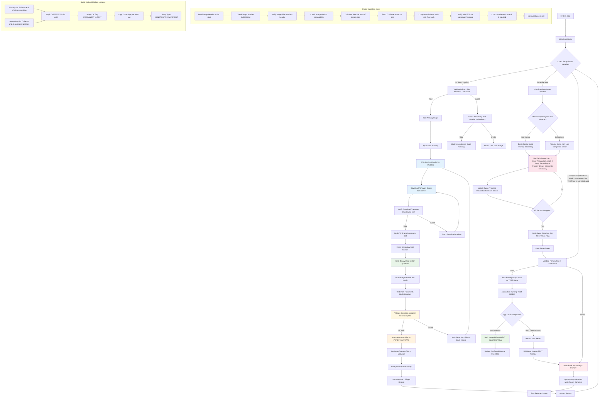

# MCUBoot notes

## Flowchart block diagram of MCUBoot and FW update

```mermaid
flowchart TD
    A[System Boot] --> B[MCUBoot Starts]
    B --> C{Check Swap Status Metadata}
    
    C -->|No Swap Pending| D[Validate Primary Slot Header + Checksum]
    C -->|Swap Pending| E[Continue/Start Swap Process]
    C -->|Swap Complete TEST Mode - if we reboot but TEST flag is not yet cleared| F[Validate Primary Slot in TEST Mode]
    
    D -->|Valid| G[Boot Primary Image]
    D -->|Invalid| H[Check Secondary Slot Header + Checksum]
    
    H -->|Valid| I[Mark Secondary as Swap Pending]
    H -->|Invalid| J[PANIC - No Valid Image]
    
    F -->|Valid| K[Boot Primary Image Mark as TEST Mode]
    F -->|Invalid| L[Swap Back Secondary to Primary]
    
    L --> M[Update Swap Metadata Mark Revert Complete]
    M --> N[Boot Reverted Image]
    
    G --> O[Application Running]
    K --> P[Application Running TEST MODE]
    
    P --> Q{App Confirms Update?}
    Q -->|Yes - Confirm| R[Mark Image PERMANENT Clear TEST Flag]
    Q -->|No - Timeout/Crash| S[Reboot Auto Revert]
    
    S --> T[MCUBoot Detects TEST Timeout]
    T --> L
    
    R --> U[Update Confirmed Normal Operation]
    
    O --> V1[OTA Service Checks for Updates]
    V1 --> V2[Download Firmware Binary from Server]
    V2 --> V3[Verify Download Transport Checksum/Hash]
    V3 -->|Valid| V4[Begin Writing to Secondary Slot]
    V3 -->|Invalid| V5[Retry Download or Abort]
    V5 --> V2
    
    V4 --> W1[Erase Secondary Slot Sectors]
    W1 --> W2[Write Binary Data Sector by Sector]
    W2 --> W3[Write Image Header and Magic]
    W3 --> W4[Write TLV Footer with Hash/Signature]
    
    W4 --> X1[Validate Complete Image in Secondary Slot]
    X1 -->|All Valid| Y1[Mark Secondary Slot as PENDING UPDATE]
    X1 -->|Invalid| Y2[Mark Secondary Slot as BAD - Erase]
    Y2 --> V1
    
    Y1 --> Z1[Set Swap Request Flag in Metadata]
    Z1 --> Z2[Notify User Update Ready]
    Z2 --> AA[User Confirms - Trigger Reboot]
    AA --> BB[System Reboot]
    BB --> C
    
    E --> CC{Check Swap Progress from Metadata}
    CC -->|Not Started| DD[Begin Sector Swap Primary Secondary]
    CC -->|In Progress| EE[Resume Swap from Last Completed Sector]
    
    DD --> FF[For Each Sector Pair: 1 Copy Primary to Scratch 2 Copy Secondary to Primary 3 Copy Scratch to Secondary]
    EE --> FF
    
    FF --> GG[Update Swap Progress Metadata After Each Sector]
    GG --> HH{All Sectors Swapped?}
    HH -->|No| FF
    HH -->|Yes| II[Mark Swap Complete Set TEST Mode Flag]
    II --> JJ[Clear Scratch Area]
    JJ --> F
    
    subgraph VAL[Image Validation Steps]
        VAL1[Read Image Header at slot start]
        VAL2[Check Magic Number 0x96f3b83d]
        VAL3[Verify Image Size matches header]
        VAL4[Check Image Version compatibility]
        VAL5[Calculate SHA256 hash of image data]
        VAL6[Read TLV footer at end of slot]
        VAL7[Compare calculated hash with TLV hash]
        VAL8[Verify RSA/ECDSA signature if enabled]
        VAL9[Check Hardware ID match if required]
        VAL10[Mark validation result]
        
        VAL1 --> VAL2
        VAL2 --> VAL3
        VAL3 --> VAL4
        VAL4 --> VAL5
        VAL5 --> VAL6
        VAL6 --> VAL7
        VAL7 --> VAL8
        VAL8 --> VAL9
        VAL9 --> VAL10
    end
    
    subgraph TRAILER[Swap Status Metadata Location]
        TRAI1[Primary Slot Trailer at end of primary partition]
        TRAI2[Secondary Slot Trailer at end of secondary partition]
        TRAI3[Magic 0x77777777 if slot valid]
        TRAI4[Image OK flag PERMANENT vs TEST]
        TRAI5[Copy Done flags per sector pair]
        TRAI6[Swap Type NONE/TEST/PERM/REVERT]
        
        TRAI1 --> TRAI3
        TRAI2 --> TRAI3
        TRAI3 --> TRAI4
        TRAI4 --> TRAI5
        TRAI5 --> TRAI6
    end
    
    style V1 fill:#e3f2fd
    style V2 fill:#e3f2fd  
    style W2 fill:#e8f5e8
    style X1 fill:#fff8e1
    style Y1 fill:#fff3e0
    style FF fill:#fce4ec
    style L fill:#ffebee
    style R fill:#e8f5e8
```