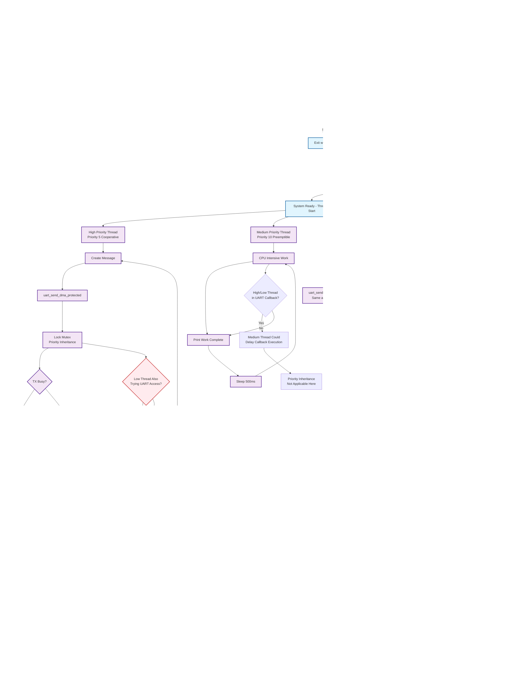

# UART boilerplate documentation

## Flowchart block diagram

```mermaid
flowchart TD
    %% System Initialization
    A[System Boot] --> B[main starts]
    B --> C[Initialize Mutexes & Semaphores]
    C --> D[Get UART Device]
    D --> E{UART Ready?}
    E -->|No| F[Exit with Error]
    E -->|Yes| G[Verify DMA Configuration]
    G --> H[Register UART Callback]
    H --> I[Start DMA RX]
    I --> J[System Ready - Threads Start]
    
    %% Thread Creation
    J --> K[High Priority Thread<br/>Priority 5 Cooperative]
    J --> L[Medium Priority Thread<br/>Priority 10 Preemptible]
    J --> M[Low Priority Thread<br/>Priority 15 Preemptible]
    J --> N[Main Thread Loop]
    
    %% High Priority Thread Flow
    K --> K1[Create Message]
    K1 --> K2[uart_send_dma_protected]
    K2 --> K3[Lock Mutex<br/>Priority Inheritance]
    K3 --> K4{TX Busy?}
    K4 -->|Yes| K5[Return EBUSY]
    K4 -->|No| K6[Mark TX Busy<br/>Copy to DMA Buffer]
    K6 --> K7[Start DMA TX<br/>uart_tx]
    K7 --> K8[Unlock Mutex]
    K8 --> K9[Wait on Semaphore<br/>k_sem_take]
    
    %% DMA TX Operation
    K7 --> DMA1[DMA Controller<br/>Takes Over]
    DMA1 --> DMA2[DMA Transfers Data<br/>CPU is Free]
    DMA2 --> DMA3[DMA Complete<br/>Interrupt Generated]
    
    %% UART Callback
    DMA3 --> CB1[UART Interrupt Handler]
    CB1 --> CB2[uart_callback Function]
    CB2 --> CB3[UART_TX_DONE Event]
    CB3 --> CB4[k_sem_give<br/>Wake Waiting Thread]
    CB4 --> K10[TX Complete<br/>Clear Busy Flag]
    K10 --> K11[Sleep 3 seconds]
    K11 --> K1
    
    %% Medium Priority Thread
    L --> L1[CPU Intensive Work]
    L1 --> L2[Print Work Complete]
    L2 --> L3[Sleep 500ms]
    L3 --> L1
    
    %% Low Priority Thread Similar Flow
    M --> M1[Create Message]
    M1 --> M2[uart_send_dma_protected<br/>Same as High Priority]
    M2 --> M3[Sleep 4 seconds]
    M3 --> M1
    
    %% Main Thread
    N --> N1[Sleep 10 seconds]
    N1 --> N2[Print System Status]
    N2 --> N1
    
    %% RX Flow
    I --> RX1[Continuous DMA RX Active]
    RX1 --> RX2[Data Received]
    RX2 --> RX3[DMA RX Interrupt]
    RX3 --> CB5[uart_callback<br/>UART_RX_RDY]
    CB5 --> RX4[Process RX Data<br/>Print to Console]
    RX4 --> RX5[Provide Next Buffer<br/>Continue RX]
    RX5 --> RX1
    
    %% Priority Inversion Protection Scenario
    K3 --> PI1{Low Thread Also<br/>Trying UART Access?}
    PI1 -->|Yes| PI2[Low Thread Blocked<br/>by Mutex]
    PI2 --> PI3[High Thread Completes<br/>Releases Mutex]
    PI3 --> PI4[Low Thread Can Now<br/>Acquire Mutex]
    PI1 -->|No| K6
    
    %% Medium Thread Potential Interference
    L1 --> INT1{High/Low Thread<br/>in UART Callback?}
    INT1 -->|Yes| INT2[Medium Thread Could<br/>Delay Callback Execution]
    INT2 --> INT3[Priority Inheritance<br/>Not Applicable Here]
    INT1 -->|No| L2
    
    %% Styling
    classDef init fill:#e1f5fe,stroke:#01579b,stroke-width:2px
    classDef thread fill:#f3e5f5,stroke:#4a148c,stroke-width:2px
    classDef dma fill:#e8f5e8,stroke:#2e7d32,stroke-width:2px
    classDef callback fill:#fff3e0,stroke:#ef6c00,stroke-width:2px
    classDef protection fill:#ffebee,stroke:#c62828,stroke-width:2px
    
    class A,B,C,D,E,F,G,H,I,J init
    class K,K1,K2,K3,K4,K5,K6,K7,K8,K9,K10,K11,L,L1,L2,L3,M,M1,M2,M3,N,N1,N2 thread
    class DMA1,DMA2,DMA3,RX1,RX2,RX3,RX4,RX5 dma
    class CB1,CB2,CB3,CB4,CB5 callback
    class PI1,PI2,PI3,PI4 protection
```