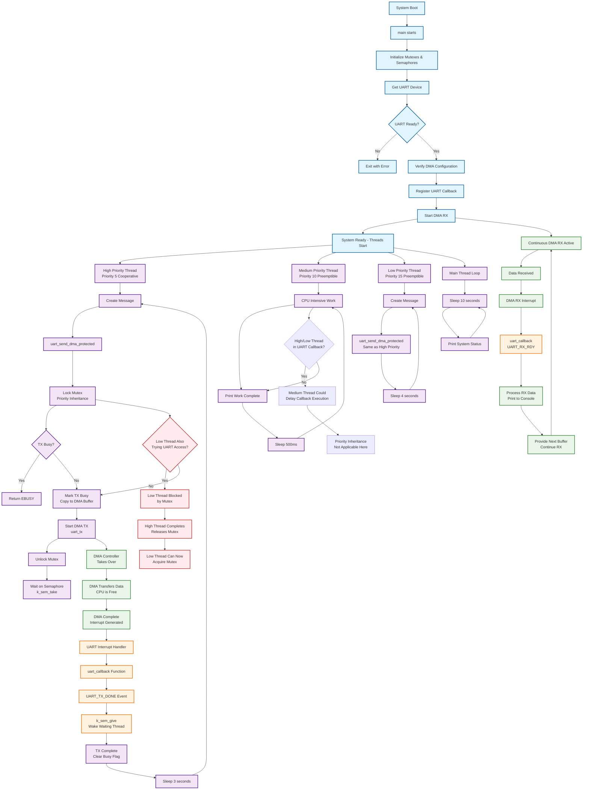
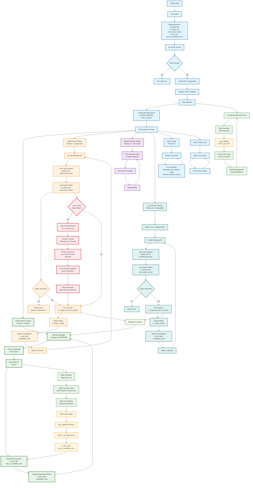

# UART boilerplate documentation

## Flowchart block diagram of uart_boilerplate.c

```mermaid
flowchart TD
    %% System Initialization
    A[System Boot] --> B[main starts]
    B --> C[Initialize Mutexes & Semaphores]
    C --> D[Get UART Device]
    D --> E{UART Ready?}
    E -->|No| F[Exit with Error]
    E -->|Yes| G[Verify DMA Configuration]
    G --> H[Register UART Callback]
    H --> I[Start DMA RX]
    I --> J[System Ready - Threads Start]
    
    %% Thread Creation
    J --> K[High Priority Thread<br/>Priority 5 Cooperative]
    J --> L[Medium Priority Thread<br/>Priority 10 Preemptible]
    J --> M[Low Priority Thread<br/>Priority 15 Preemptible]
    J --> N[Main Thread Loop]
    
    %% High Priority Thread Flow
    K --> K1[Create Message]
    K1 --> K2[uart_send_dma_protected]
    K2 --> K3[Lock Mutex<br/>Priority Inheritance]
    K3 --> K4{TX Busy?}
    K4 -->|Yes| K5[Return EBUSY]
    K4 -->|No| K6[Mark TX Busy<br/>Copy to DMA Buffer]
    K6 --> K7[Start DMA TX<br/>uart_tx]
    K7 --> K8[Unlock Mutex]
    K8 --> K9[Wait on Semaphore<br/>k_sem_take]
    
    %% DMA TX Operation
    K7 --> DMA1[DMA Controller<br/>Takes Over]
    DMA1 --> DMA2[DMA Transfers Data<br/>CPU is Free]
    DMA2 --> DMA3[DMA Complete<br/>Interrupt Generated]
    
    %% UART Callback
    DMA3 --> CB1[UART Interrupt Handler]
    CB1 --> CB2[uart_callback Function]
    CB2 --> CB3[UART_TX_DONE Event]
    CB3 --> CB4[k_sem_give<br/>Wake Waiting Thread]
    CB4 --> K10[TX Complete<br/>Clear Busy Flag]
    K10 --> K11[Sleep 3 seconds]
    K11 --> K1
    
    %% Medium Priority Thread
    L --> L1[CPU Intensive Work]
    L1 --> L2[Print Work Complete]
    L2 --> L3[Sleep 500ms]
    L3 --> L1
    
    %% Low Priority Thread Similar Flow
    M --> M1[Create Message]
    M1 --> M2[uart_send_dma_protected<br/>Same as High Priority]
    M2 --> M3[Sleep 4 seconds]
    M3 --> M1
    
    %% Main Thread
    N --> N1[Sleep 10 seconds]
    N1 --> N2[Print System Status]
    N2 --> N1
    
    %% RX Flow
    I --> RX1[Continuous DMA RX Active]
    RX1 --> RX2[Data Received]
    RX2 --> RX3[DMA RX Interrupt]
    RX3 --> CB5[uart_callback<br/>UART_RX_RDY]
    CB5 --> RX4[Process RX Data<br/>Print to Console]
    RX4 --> RX5[Provide Next Buffer<br/>Continue RX]
    RX5 --> RX1
    
    %% Priority Inversion Protection Scenario
    K3 --> PI1{Low Thread Also<br/>Trying UART Access?}
    PI1 -->|Yes| PI2[Low Thread Blocked<br/>by Mutex]
    PI2 --> PI3[High Thread Completes<br/>Releases Mutex]
    PI3 --> PI4[Low Thread Can Now<br/>Acquire Mutex]
    PI1 -->|No| K6
    
    %% Medium Thread Potential Interference
    L1 --> INT1{High/Low Thread<br/>in UART Callback?}
    INT1 -->|Yes| INT2[Medium Thread Could<br/>Delay Callback Execution]
    INT2 --> INT3[Priority Inheritance<br/>Not Applicable Here]
    INT1 -->|No| L2
    
    %% Styling
    classDef init fill:#e1f5fe,stroke:#01579b,stroke-width:2px
    classDef thread fill:#f3e5f5,stroke:#4a148c,stroke-width:2px
    classDef dma fill:#e8f5e8,stroke:#2e7d32,stroke-width:2px
    classDef callback fill:#fff3e0,stroke:#ef6c00,stroke-width:2px
    classDef protection fill:#ffebee,stroke:#c62828,stroke-width:2px
    
    class A,B,C,D,E,F,G,H,I,J init
    class K,K1,K2,K3,K4,K5,K6,K7,K8,K9,K10,K11,L,L1,L2,L3,M,M1,M2,M3,N,N1,N2 thread
    class DMA1,DMA2,DMA3,RX1,RX2,RX3,RX4,RX5 dma
    class CB1,CB2,CB3,CB4,CB5 callback
    class PI1,PI2,PI3,PI4 protection
```

## Flowchart block diagram of uart_boilerplate_queue.c

```mermaid
flowchart TD
    %% System Initialization
    A[System Boot] --> B[main starts]
    B --> C[Initialize Mutex & Semaphores<br/>k_mutex_init uart_queue_mutex<br/>k_sem_init uart_tx_complete_sem]
    C --> D[Get UART Device]
    D --> E{UART Ready?}
    E -->|No| F[Exit with Error]
    E -->|Yes| G[Verify DMA Configuration]
    G --> H[Register UART Callback]
    H --> I[Start DMA RX]
    I --> J[Create Message Queue<br/>K_MSGQ_DEFINE uart_tx_queue]
    J --> K[All Threads Auto-Start]
    
    %% Thread Creation
    K --> L[UART Worker Thread<br/>Priority 3 - Highest]
    K --> M[High Priority Thread<br/>Priority 5 - Cooperative]
    K --> N[Medium Priority Thread<br/>Priority 10 - CPU Work]
    K --> O[Low Priority Thread<br/>Priority 15 - Preemptible]
    K --> P[Stats Thread<br/>Priority 20]
    K --> Q[Main Thread Loop]
    
    %% UART Worker Thread Flow
    L --> L1[Wait for Message<br/>k_msgq_get FOREVER]
    L1 --> L2[Process Message<br/>from Queue]
    L2 --> L3[Start DMA TX<br/>uart_tx]
    L3 --> L4[Wait DMA Complete<br/>k_sem_take uart_tx_complete_sem]
    L4 --> L5[Signal Requesting Thread<br/>k_sem_give completion_sem]
    L5 --> L1
    
    %% High Priority Thread Flow
    M --> M1[Create Message #N]
    M1 --> M2[uart_send_queued<br/>sender_id=1, synchronous=true]
    M2 --> M3[Lock Queue Mutex<br/>k_mutex_lock uart_queue_mutex]
    M3 --> M4{Mutex Acquired?}
    M4 -->|No| M5[Return Error<br/>queue_contentions++]
    M4 -->|Yes| M6[Put in Queue<br/>k_msgq_put uart_tx_queue]
    M6 --> M7[Unlock Mutex<br/>k_mutex_unlock]
    M7 --> M8[Wait for Completion<br/>k_sem_take completion_sem]
    M8 --> M9[Sleep 2 seconds]
    M9 --> M1
    
    %% Medium Priority Thread Flow - CPU Intensive
    N --> N1[CPU Intensive Work<br/>3 million iterations]
    N1 --> N2[Print Work Complete]
    N2 --> N3[Sleep 800ms]
    N3 --> N1
    
    %% Low Priority Thread Flow
    O --> O1[Sleep 1 sec - Delayed Start]
    O1 --> O2[Create Message #N]
    O2 --> O3[uart_send_queued<br/>sender_id=15, synchronous=true]
    O3 --> O4[Lock Queue Mutex<br/>k_mutex_lock uart_queue_mutex]
    O4 --> O5{Mutex Acquired?}
    O5 -->|No| O6[Return Error]
    O5 -->|Yes| O7[Put in Queue<br/>k_msgq_put uart_tx_queue]
    O7 --> O8[Unlock Mutex<br/>k_mutex_unlock]
    O8 --> O9[Wait for Completion<br/>k_sem_take completion_sem]
    O9 --> O10[Sleep 3 seconds]
    O10 --> O2
    
    %% DMA Operations
    L3 --> DMA1[DMA Controller<br/>Takes Over TX]
    DMA1 --> DMA2[DMA Transfers Data<br/>UART Worker Thread Free]
    DMA2 --> DMA3[DMA TX Complete<br/>Interrupt Generated]
    
    %% UART Callback Flow
    DMA3 --> CB1[UART ISR Handler]
    CB1 --> CB2[uart_callback Function]
    CB2 --> CB3[UART_TX_DONE Event]
    CB3 --> CB4[k_sem_give<br/>uart_tx_complete_sem]
    CB4 --> L4
    
    %% RX Flow
    I --> RX1[Continuous DMA RX Active]
    RX1 --> RX2[Data Received<br/>DMA Interrupt]
    RX2 --> CB5[uart_callback<br/>UART_RX_RDY]
    CB5 --> RX3[Process RX Data<br/>Print to Console]
    RX3 --> RX4[Buffer Management<br/>Double Buffering]
    RX4 --> RX1
    
    %% Priority Inversion Protection Scenario
    M3 --> PI1{Low Thread<br/>Holds Mutex?}
    PI1 -->|Yes| PI2[High Thread Blocked<br/>on k_mutex_lock]
    PI2 --> PI3[Medium Thread<br/>Preempts Low Thread]
    PI3 --> PI4[Priority Inheritance<br/>Low Thread Priority Boosted]
    PI4 --> PI5[Low Thread Completes<br/>Queue Operation]
    PI5 --> PI6[Mutex Released<br/>High Thread Unblocked]
    PI6 --> M6
    PI1 -->|No| M6
    
    %% Queue Message Flow
    M6 --> QF1[Message in Queue]
    O7 --> QF1
    QF1 --> L1
    
    %% Stats Thread
    P --> P1[Sleep 15 seconds]
    P1 --> P2[Print Statistics<br/>Messages sent, Queue usage<br/>Priority inversion events]
    P2 --> P1
    
    %% Main Thread
    Q --> Q1[Sleep 30 seconds]
    Q1 --> Q2[Print System Status]
    Q2 --> Q1
    
    %% Styling
    classDef init fill:#e1f5fe,stroke:#01579b,stroke-width:2px
    classDef worker fill:#e8f5e8,stroke:#2e7d32,stroke-width:3px
    classDef high fill:#fff3e0,stroke:#f57c00,stroke-width:2px
    classDef medium fill:#f3e5f5,stroke:#7b1fa2,stroke-width:2px
    classDef low fill:#e0f2f1,stroke:#00695c,stroke-width:2px
    classDef dma fill:#e8f5e8,stroke:#388e3c,stroke-width:2px
    classDef callback fill:#fff8e1,stroke:#ff8f00,stroke-width:2px
    classDef protection fill:#ffebee,stroke:#c62828,stroke-width:3px
    classDef queue fill:#f1f8e9,stroke:#558b2f,stroke-width:2px
    
    class A,B,C,D,E,F,G,H,I,J,K init
    class L,L1,L2,L3,L4,L5 worker
    class M,M1,M2,M3,M4,M5,M6,M7,M8,M9 high
    class N,N1,N2,N3 medium
    class O,O1,O2,O3,O4,O5,O6,O7,O8,O9,O10 low
    class DMA1,DMA2,DMA3,RX1,RX2,RX3,RX4 dma
    class CB1,CB2,CB3,CB4,CB5 callback
    class PI1,PI2,PI3,PI4,PI5,PI6 protection
    class QF1 queue
    class P,P1,P2,Q,Q1,Q2 init
```